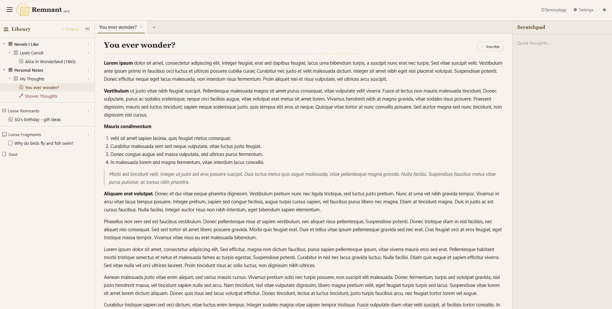

# Remnant — A Quiet Place to Write

A personal note-taking app built around a nested Library, end-to-end encrypted notes, and ephemeral thoughts that fade on their own. Organize writing into Corpora, Scrolls, and Remnants; lock anything sensitive behind a passphrase only you know; jot passing ideas as Fragments that decay unless you tend to them. No build tools, no npm, no passwords stored anywhere — just static files and a Cloudflare Worker backend for authentication and cross-device sync.

#### Demo:
https://badbox29.github.io/remnant

---

#### Screenshot


---

## Features

- **Nested Library** — organize writing four levels deep: Library → Corpus → Scroll → Remnant; drag to reorder anywhere in the tree
- **Remnants** — single saved pieces of writing (what most tools call "notes"), edited in a syntax-highlighted Markdown editor
- **Loose Remnants** — any Remnant or Cipher can live outside a Scroll, waiting in a Loose Remnants section at the bottom of the Library until you decide where it belongs
- **Ciphers** — Remnants encrypted client-side with a passphrase; AES-256-GCM with an Argon2id-derived key, encrypted one line at a time
- **Spotlight reveal** — an unlocked Cipher stays disguised at rest; only a small window of real text follows your cursor as you read, so a glance over your shoulder sees gibberish, not your words
- **Illuminate** — an explicit, separately-gated mode that decrypts a Cipher's full body when you need to read or edit the whole thing at once
- **No recovery by design** — a Cipher's passphrase is never stored in any form, anywhere; a forgotten passphrase means permanently lost content (the encryption isn't protecting anything otherwise)
- **Fragments** — title-less passing thoughts that live outside the hierarchy in Loose Fragments; merge two together or promote one into a full Remnant when an idea is ready to stick
- **Fragment decay → Dust** — a Fragment left untouched for 28 days fades into Dust, where it waits a final 7 days to be salvaged before it's hard-deleted for good
- **Deletion Log** — a lightweight record of what Dust has swept away, kept as snippets rather than full content
- **Scratchpad** — a pop-out, spellcheck-free free-form drawer for anything that doesn't belong in the Library yet
- **Markdown editor** — EasyMDE (CodeMirror), showing syntax-highlighted raw Markdown rather than hiding the syntax
- **Export & Import** — download your whole Library as a zip mirroring the Corpus → Scroll → Remnant hierarchy, each note as its own `.md` file (Ciphers optionally decrypted); re-import Remnant's own export format with a full round-trip
- **Three-tier accounts** — Guest (local only), Token (128-bit, KV-synced), or Google sign-in; one-way upgrade path from Guest → Token or Google, Token → Google
- **Cross-device sync** — token- or Google-based KV sync via Cloudflare Worker; pick up where you left off on any browser
- **Dark mode** — full light/dark theme with warm/gold light tones and cool/silver dark tones; preference persisted, no flash on load
- **Mobile responsive** — collapsing topbar, full-width note titles, scratchpad as a pop-out drawer

---

## File Structure

```
remnant/
├── index.html              # App entry point
├── css/
│   └── styles.css          # All styles
├── js/
│   ├── app.js              # Client-side app logic, UI, sync orchestration
│   ├── auth.js             # Portable three-tier auth module (Guest/Token/Google)
│   ├── cipher.js           # Cryptographic core — Argon2id KDF + AES-256-GCM
│   ├── notesStore.js       # IndexedDB wrapper (notes, structure, scratchpad)
│   └── vendor/
│       ├── argon2.umd.min.js       # hash-wasm Argon2id build
│       ├── easymde.min.js          # Markdown editor (CodeMirror 5)
│       ├── easymde.min.css
│       ├── easymde.LICENSE
│       ├── fflate.min.js           # Zip packing/unpacking for export/import
│       ├── fflate.LICENSE
│       └── hash-wasm-LICENSE.txt
├── worker.js               # Cloudflare Worker (deploy separately)
└── README.md
```

> **A note on naming:** the UI says *Corpus / Scroll / Remnant*, but inside `notesStore.js` and the KV wire format these stay *book / chapter / note*. It's a display-only rename — the underlying identifiers were left untouched to avoid migrating the schema for no user-visible benefit.

---

## Setup

### 1. Get the files

Clone or download this repository. The app is entirely static — `index.html`, `css/styles.css`, and everything under `js/` are all you need to run it.

Open `index.html` directly in a browser for local, guest-only use, or host it on GitHub Pages (or any static host) for a permanent URL with sync.

---

### 2. Deploy the Cloudflare Worker

The Worker is Remnant's backend. It verifies Google sign-ins, signs/authenticates token requests via HMAC, and provides the KV storage that backs cross-device sync. The app runs without it in local guest mode, but sync and Google accounts require it.

A free Cloudflare account is sufficient for personal use. The $5/month Workers Paid plan is recommended if you expect heavier usage or want higher KV read/write limits.

#### 2a. Create the Worker

1. Log in to [dash.cloudflare.com](https://dash.cloudflare.com) and open **Workers & Pages**.
2. Click **Create** → **Create Worker**.
3. Give it a name (e.g. `remnant-worker`) and click **Deploy**.
4. Click **Edit code**, paste the entire contents of `worker.js` into the editor, and click **Deploy** again.
5. Note your worker URL — it will look like `https://your-worker-name.your-subdomain.workers.dev`.

#### 2b. Create a KV namespace

1. In the Cloudflare dashboard, go to **Workers & Pages → KV**.
2. Click **Create a namespace**, name it (e.g. `remnant-kv`), and click **Add**.
3. Go back to your Worker → **Settings → Bindings**.
4. Click **Add** → **KV Namespace**.
5. Set the **Variable name** to exactly `REMNANT_KV` and select the namespace you just created.
6. Click **Deploy** to save the binding.

> **Why `REMNANT_KV`?** The worker references `env.REMNANT_KV` by that exact name. A different variable name will break every storage and auth route.

#### 2c. Set environment variables

In your Worker → **Settings → Variables and Secrets**, add the following:

| Variable | Type | Value |
|---|---|---|
| `GOOGLE_CLIENT_ID` | Text | Your Google OAuth Client ID (only required if you want Google sign-in) |
| `ALLOWED_ORIGINS` | Text | Comma-separated list of allowed origins (see below) |

**`ALLOWED_ORIGINS` example:**
```
https://badbox29.github.io,http://localhost:3000
```

Include every URL from which you'll access the app. Requests from unlisted origins are rejected at the CORS layer.

> **Note:** The Google Client ID is never embedded in the app source — the frontend fetches it at runtime from the Worker's `GET /auth/config`. Token-only and guest accounts don't need it at all; leave it unset if you don't want Google sign-in.

#### 2d. Set up Google sign-in (optional)

Only needed if you want the Google account tier. Token-based sync works without any of this.

1. Go to [console.cloud.google.com](https://console.cloud.google.com) and open (or create) a project.
2. Under **APIs & Services → Credentials**, create an **OAuth 2.0 Client ID** of type **Web application**.
3. Add your app origins (e.g. `https://badbox29.github.io`, `http://localhost:3000`) to **Authorized JavaScript origins**.
4. Copy the resulting Client ID into the Worker's `GOOGLE_CLIENT_ID` variable (2c above).

> Remnant uses Google Identity Services in **popup** mode — no redirect URI registration is required.

#### 2e. Point the app at your Worker

1. Open the app in your browser.
2. Open **Settings** (gear icon).
3. Paste your Worker URL into the **Worker URL** field and save.

The app will begin routing authentication and storage operations through your Worker.

---

### 3. Accounts & Cross-Device Sync

Remnant has three account tiers, with a one-way upgrade path (Guest → Token or Google, Token → Google):

- **Guest** — local only. Everything lives in this browser's IndexedDB and localStorage. No Worker, no sync, no credentials.
- **Token** — a 128-bit cryptographic token is your identity in KV. Requests are HMAC-signed by the client and verified by the Worker.
- **Google** — sign in with Google; the Worker verifies the ID token (RS256, against Google's published keys) on every request.

To sync a Token account to a new device:

- On your **primary browser**: open Settings, copy your **Sync Token**, and save it somewhere safe.
- On a **new browser or device**: open Settings, paste your token into the **Sync Token** field, and save. Both browsers now share the same KV data.

Legacy tokens generated before the current scheme are detected at boot and offered an upgrade; secondary devices migrate silently via a server-side forwarding pointer. A Token account can also be migrated to Google from Settings — the migration is HMAC-authenticated so only the token's true owner can move its data.

---

## Worker Routes Reference

| Method | Route | Description |
|---|---|---|
| `GET` | `/` | Health check (open CORS) |
| `GET` | `/ping` | Health check (open CORS) |
| `GET` | `/auth/config` | Return Google Client ID for GIS bootstrap |
| `POST` | `/auth/google` | Verify a Google ID token, return its KV key |
| `POST` | `/auth/verify` | Re-verify a stored Google credential at boot |
| `POST` | `/auth/migrate` | Token → Google migration (HMAC-authenticated) |
| `GET` | `/storage/:token` | List all KV keys for a user token |
| `GET` | `/storage/:token/:key` | Read a KV value |
| `PUT` | `/storage/:token/:key` | Write a KV value (HMAC signed) |
| `DELETE` | `/storage/:token/:key` | Delete a KV value |

Auth routes are IP rate-limited; storage routes are per-token rate-limited.

---

## Data Storage

Note content, the Library structure, and the scratchpad live in the browser's **IndexedDB** — not localStorage — so a long history of writing never approaches localStorage's ~5MB per-origin ceiling. localStorage holds only small account and tab metadata (auth method, token, open-tab state, theme preference).

When an account is synced, the data blob is mirrored to **Cloudflare KV** under your user token. KV is the source of truth when both are present; the local copy is the cache and offline fallback. Nothing is stored server-side beyond what you save, there are no passwords, and a Cipher's plaintext never leaves your browser — KV only ever holds encrypted blobs the Worker cannot decrypt.

---

## Security Model

- **Ciphers are end-to-end encrypted in the browser.** The Worker, KV, and sync layer only ever see ciphertext. The plaintext exists only in memory, and the spotlight reveal keeps even that to one line at a time during normal reading.
- **Key derivation** uses Argon2id (memory-hard, via the vendored hash-wasm build), chosen over PBKDF2 specifically to resist cheap parallel GPU/ASIC brute-forcing. Each Cipher has its own random salt; KDF parameters are stored alongside the ciphertext so the same key can be re-derived later.
- **Encryption** uses AES-256-GCM via the browser's native Web Crypto API. It's authenticated — a wrong passphrase fails decryption outright rather than silently producing garbage, which is what lets the app tell you "wrong passphrase" with confidence.
- **Per-line encryption** means each line carries its own fresh IV, so a memory snapshot at any moment shows nearly the whole document as ciphertext. Saving re-encrypts the full line array with fresh IVs.
- **No recovery path** is intentional. The passphrase is never persisted — not on the device, not in sync, not hashed for a "remember me." Any reset that could recover the plaintext would mean the encryption was never real.

---

## External Services & Libraries

| Service / Library | Used For | Key Required | Notes |
|---|---|---|---|
| Cloudflare Workers + KV | Auth, storage, cross-device sync | No (free tier) | Self-deployed; you own the namespace |
| Google Identity Services | Google sign-in (optional tier) | OAuth Client ID | Popup mode; ID tokens verified server-side in the Worker |
| hash-wasm (Argon2id) | Cipher key derivation | No | Vendored, checksum-verified, MIT |
| Web Crypto API | AES-256-GCM, HMAC, JWT verification | No | Native browser API |
| EasyMDE (CodeMirror 5) | Markdown editing | No | Vendored, MIT |
| fflate | Zip packing for Export/Import | No | Vendored |
| Material Design Icons | UI icons | No | Loaded from jsDelivr CDN |

---

## License

See LICENSE file. Vendored libraries retain their own licenses under `js/vendor/`.
